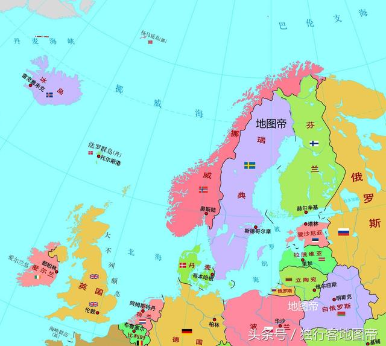

# Europe

## 德意志宗教改革（1517）
从476年西罗马帝国灭亡到1453年东罗马帝国灭亡，欧洲经历了近十个世纪的漫长的中世纪时期。

中世纪末期，教会实力强大，对欧洲各国人民强征什一税和香火钱，引发许多民众的不满。与此同时，由拜占庭逃亡道西欧的学者们带来了大量的古代经典，其中就包括了希腊文原文的圣经，引发了当时许多神学家们对基督教教义的讨论。

1517年，教皇利奥十世以修缮圣彼得大教堂为名，下令在天主教各国发售赎罪券。马丁路德在仔细研究了希腊文圣经后，认为圣经里的“因信*称*义”并不是拉丁文所翻译的“因信*成*义”，这给了他很大的触动。于是，同年10月31日，马丁路德在教堂门口贴出《九十五条论纲》，挑战“赎罪券”的正当性，并由此引发了宗教改革运动。人们将马丁路德的新教成为“抗议宗”（拉丁文Protestatio）。

马丁路德的宗教改革的主要内容为：
- 因信称义，赎罪券无用。
- 《圣经》才是信仰的权威。
- 信徒不必通过教会就可以和耶稣基督直接沟通。

### 神圣罗马帝国
1356年，

## 北欧
北欧狭义上包括五国：冰岛（Iceland）、挪威（Norway）、瑞典（Sweden）、芬兰（Finland）和丹麦(Denmark）。地形以斯堪的纳维亚半岛（Scandinavia）为主体；气候主要以温带大陆性气候和温带海洋性气候为主；人口3000万，面积350万平方公里。

到11世纪，基督教在北欧确立了优势地位，统一的教会取代了松散的异教崇拜。1066年，挪威国王哈拉尔三世入侵英格兰，在斯坦福桥战役中战死，象征着维京时代的结束。